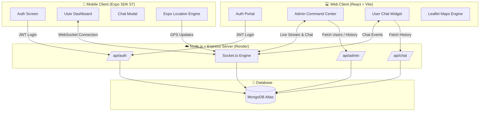

<div align="center">

# 📍 Tracker — Real-Time Location & Admin Command System

[](https://nodejs.org/)
[](https://expressjs.com/)
[](https://www.mongodb.com/)
[](https://react.dev/)
[](https://reactnative.dev/)
[](https://expo.dev/)
[](https://vercel.com/)
[](https://render.com/)

<p align="center">
  <b>A full-stack, enterprise-ready real-time location tracking and management system powered by WebSockets, MongoDB, React, Leaflet, and Expo React Native.</b>
</p>

[Key Features](#-key-features) •
[System Architecture](#-system-architecture) •
[Tech Stack](#-tech-stack) •
[Project Structure](#-project-structure) •
[Local Quick Start](#-local-quick-start) •
[Deployment Guide](#-deployment-guide)

</div>

---

## 🌟 Key Features

### 📡 Real-Time GPS Tracking & WebSockets
* **Live Position Broadcasts**: Sub-second location updates streamed via Socket.io from mobile client devices.
* **Haversine Distance Filtering**: Intelligent mobile GPS filtering prevents unnecessary network traffic when stationary.
* **Immediate GPS Lock**: Instant initial location fix upon app startup and background/foreground lifecycle changes.

### 🗺️ Interactive Command Center (Web & Admin)
* **Live Map Dashboard**: Powered by Leaflet.js with custom color-coded active/offline user markers.
* **Movement History Playback**: Inspect user historical movement paths, speed data, and timestamps.
* **User Overview & Status**: Instant toggle between online active tracking nodes and offline historical records.

### 💬 Integrated Live Chat
* **Field-to-Admin Messaging**: Direct 1-on-1 real-time socket chat widget for field personnel to communicate with system admins.
* **Unread Indicators & Badges**: Audio-visual message notifications for administrative staff.

### 📱 Cross-Platform Mobile Client
* **Expo SDK 57**: Optimized for modern Android & iOS devices.
* **Leaflet WebView Mapping**: High-performance interactive maps using `react-native-webview` for smooth cross-device rendering.
* **EAS Standalone Build Ready**: Complete profile setup for native standalone Android `.apk` generation.

---

## 🏗️ System Architecture



---

## 🛠️ Tech Stack

| Domain | Technologies Used |
| :--- | :--- |
| **Backend API** | Node.js, Express.js, Socket.io, Mongoose, JWT, bcryptjs, CORS |
| **Database** | MongoDB Atlas Cloud Database |
| **Web Client** | React 19, Vite, Leaflet.js, React-Leaflet, Tailwind CSS v4, Lucide Icons, Axios |
| **Mobile Client** | React Native, Expo SDK 57, React Native WebView, React Navigation v7, Async Storage |
| **Deployment** | Backend: **Render** • Web: **Vercel** • Mobile: **EAS (Expo Application Services)** |

---

## 📁 Project Structure

```bash
tracker/
├── server/                    # Node.js + Express + Socket.io Backend
│   ├── models/                # Mongoose Schemas (User, Location, Message)
│   ├── routes/                # REST API Endpoints (auth, admin, chat)
│   ├── index.js               # Express Server & Socket.io Event Handling
│   └── package.json
│
├── client-web/                # React 19 + Vite Web Application
│   ├── src/
│   │   ├── components/        # Auth, UserDashboard, AdminDashboard, UserChatWidget
│   │   ├── utils/             # Leaflet marker fixes & utilities
│   │   ├── config.js          # Centralized API & Socket URLs
│   │   └── App.jsx
│   ├── vercel.json            # SPA Rewrite Configuration for Vercel
│   └── package.json
│
└── client-mobile/             # Expo SDK 57 React Native Application
    ├── src/
    │   ├── screens/           # AuthScreen, UserDashboard, AdminDashboard, ChatModal
    │   └── config.js          # Live Production API URL
    ├── app.json               # Android Permissions & Manifest Config
    ├── eas.json               # EAS Standalone APK Build Profiles
    └── package.json
```

---

## 🚀 Local Quick Start

### Prerequisites
* **Node.js**: v18.x or higher
* **npm**: v9.x or higher
* **MongoDB**: Atlas Connection URI or Local MongoDB instance

---

### 1️⃣ Start Backend Server
```bash
cd server
npm install
npm start
```
> Server runs on `http://localhost:5000`

---

### 2️⃣ Start Web Client
```bash
cd client-web
npm install
npm run dev
```
> Web client runs on `http://localhost:5173`

---

### 3️⃣ Start Mobile App (Expo)
```bash
cd client-mobile
npm install
npx expo start
```
> Scan the QR code using the **Expo Go** app on Android or iOS.

---

## 🌐 Production Deployment

### 1. Backend Server (Render.com)
1. Create a **Web Service** on Render connected to your Git repository.
2. Set **Root Directory** to `server`.
3. Build Command: `npm install`
4. Start Command: `node index.js`
5. Set Environment Variable:
   - `MONGO_URI`: `mongodb+srv://<username>:<password>@cluster.mongodb.net/tracker`

---

### 2. Web Client (Vercel)
1. Import repository to **Vercel**.
2. Set **Root Directory** to `client-web`.
3. Add Environment Variable:
   - `VITE_API_URL`: `https://tracker-server-9626.onrender.com`
4. Deploy!

---

### 3. Mobile Standalone APK (Expo EAS)
Run the following command inside `client-mobile/` to build a standalone Android `.apk`:

```bash
cd client-mobile
npx eas-cli build -p android --profile preview
```

---

## 🛡️ License

Distributed under the **MIT License**. See `LICENSE` for more information.

---

<div align="center">
  <sub>Built with ❤️ by Mahir & team.</sub>
</div>
